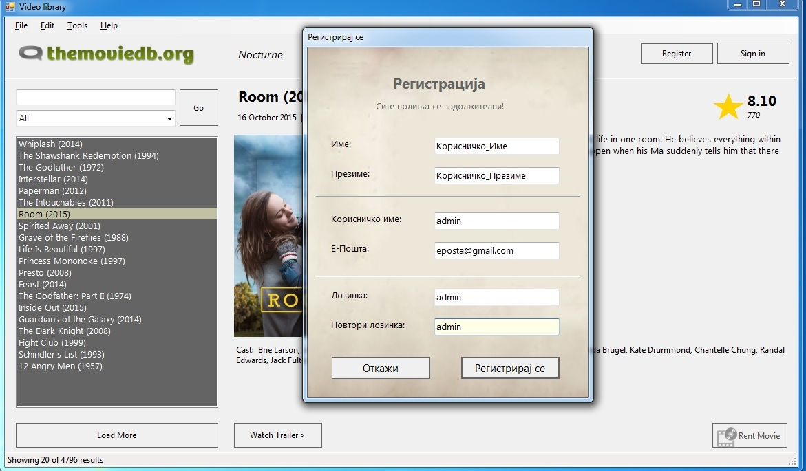
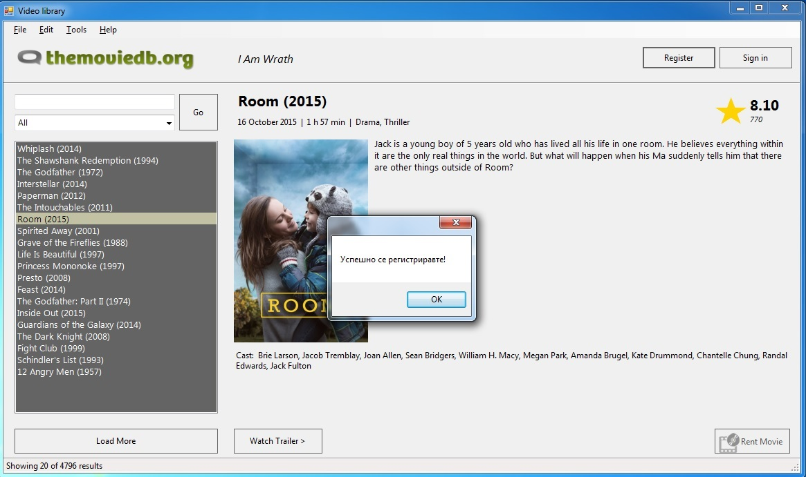
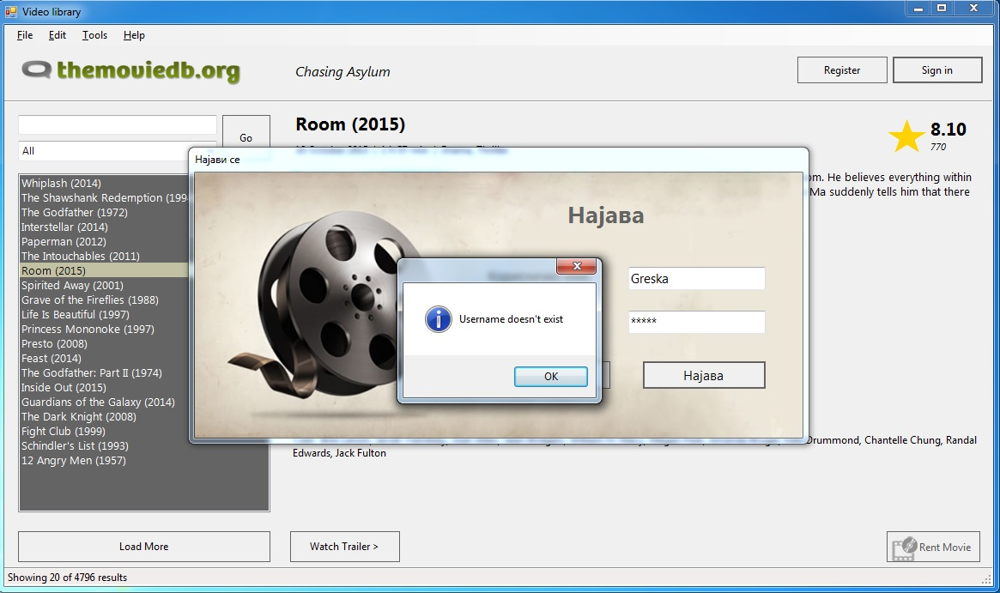
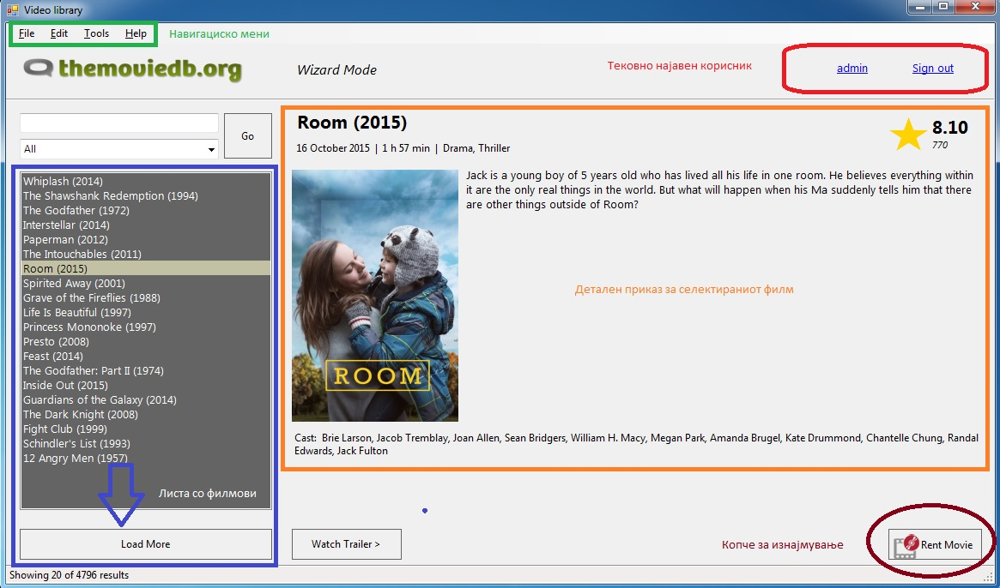
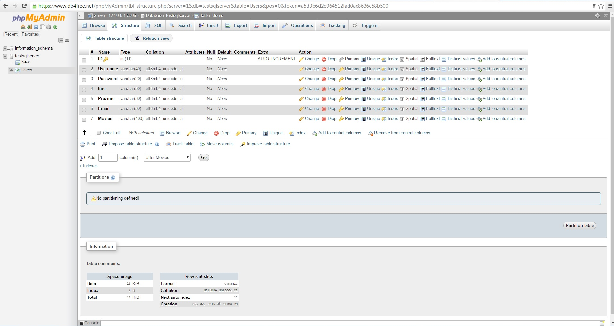

# Документација
## 1. Oпис на апликацијата ##
   Апликацијата која што ја изработивме претставува Видеотека со голем асортиман/избор на филмови за прегледување/preview (кратка содржина - plot од избраниот филм, genre, cast - учесници, runtime - времетраење, година на издавање и можност за гледање на trailer од избраниот филм). Покрај можноста за прегледување на филмови, апликацијата дополнително овозможува за секој најавен корисник изнајмување на посакуваниот филм на одреден временски рок. Со цел да им се овозможи на корисниците поедноставено користење на самата Видеотека, додадовме функционалност за пребарување на филмови по одреден жанр и по внесено име на филмот. Секој регистриран корисник има привилегија и достапност за увид на својата листа на изнајмени филмови и својот личен, персонален профил и личните податоци.
   

## 2. Корисничко сценарио/Упатство за користење на апликацијата ##
На горната слика е прикажан основниот изглед на апликацијата (Слика 1). За полесна навигација во самата апликација служи горното мени, кое содржи и некои дополнителни опции, како што е About страницата. Во горниот десен агол се сместени две копчиња: Register & SignIn. 
При клик на копчето Register, се отвара нова форма во која корисникот на апликацијата треба да ги пополни сите зададени полиња со своите лични податоци ( Слика 2). Откако ќе биде успешно регистриран, се прикажува соодветна порака за известување (Слика 3). Доколку корисникот веќе се има регистрирано, директно преку копчето SignIn може да се најави на системот. Доколку при најавувањето корисникот, внесе погрешен username или password, исто така ќе се прикаже соодветна порака за грешка (Слика 4). 

Откако корисникот ќе се најави, неговиот username се прикажува во горниот десен агол и покрај него опција за одјавување.
На левата страна од прозорецот на апликацијата, прикажани се листа со 20 предефинирани филмови. Со клик на копчето Load more, ќе се излистаат уште 20 дополнителни филмови итн. Во долниот statusStrip се доделува информација за бројот на прикажани филмови. Во самиот центар на апликацијата се наоѓа детален приказ за тековно избраниот филм од листата со филмови (опишано погоре во самиот опис на апликацијата) (Слика 5). Секој најавен корисник има дополнителна можност да изнајми филм, кој ќе биде додаден во неговата кошничка со преостанато време на филмот (Слика 6).

## 3. Претставување на проблемот
За потребите на апликацијата искористени е PHP база на податоци хостирана на следната страна (https://www.db4free.net/), која ни служи за зачувување на податоците на корисникот при регистрацијата и понатамошно пребарување низ истата при валидацијата( најавувањето на корисникот во системот). За приказ, детали и напредно филтрирање на филмови според жанрот и името, користиме Tmdb API.
## 3.1 База на податоци
На сликата бр.7 e прикажана структурата на табелата Users, која содржи 7 колони соодветни за секој User.

