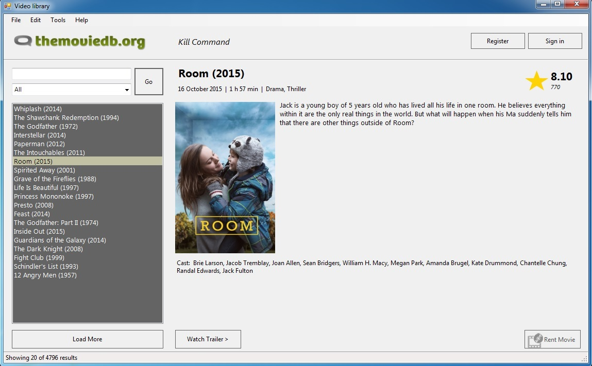
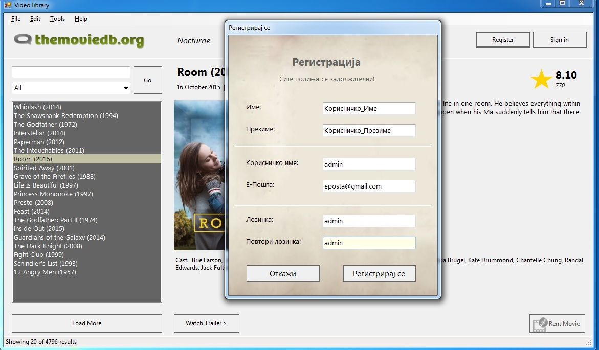
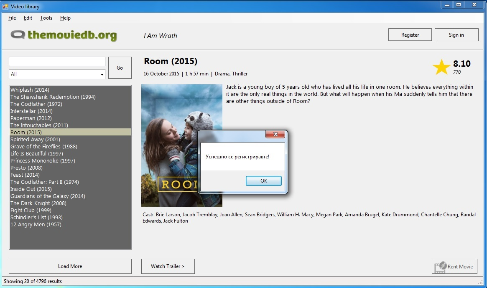
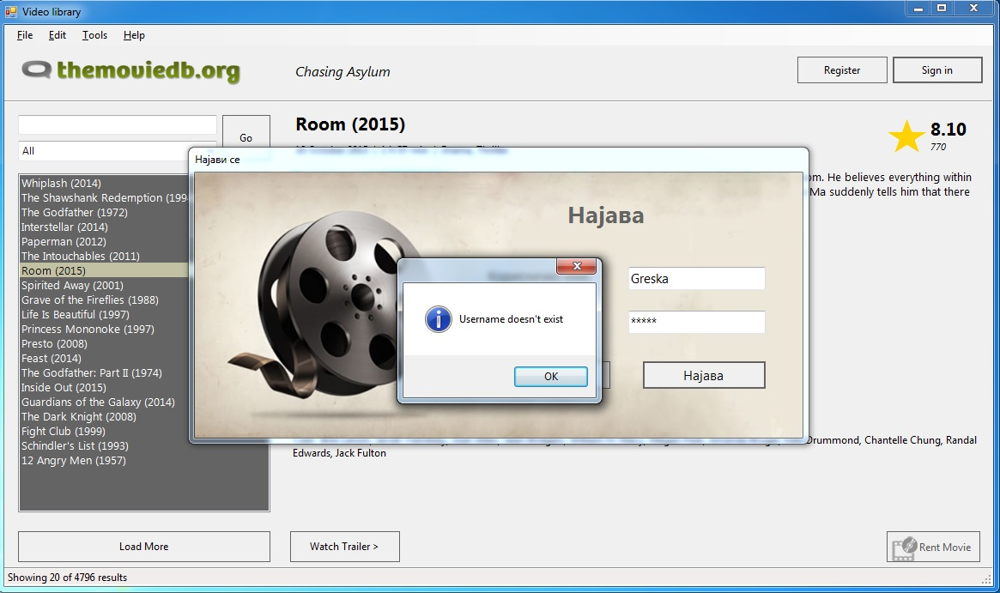
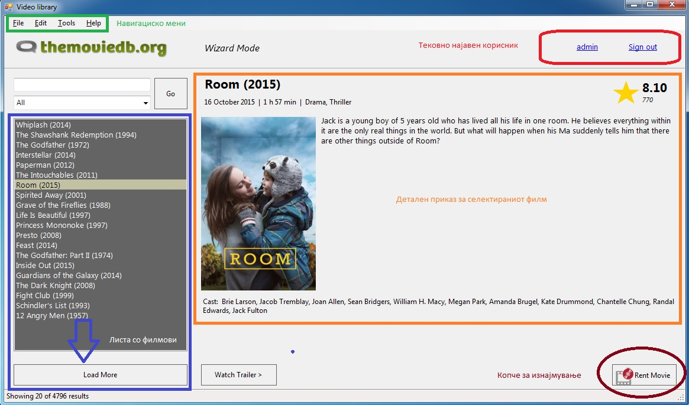
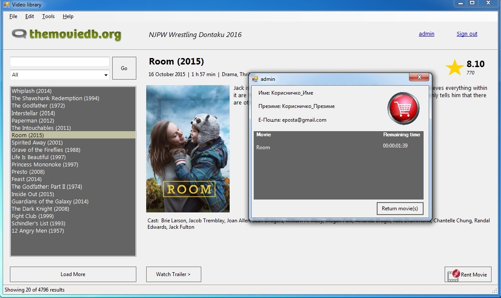
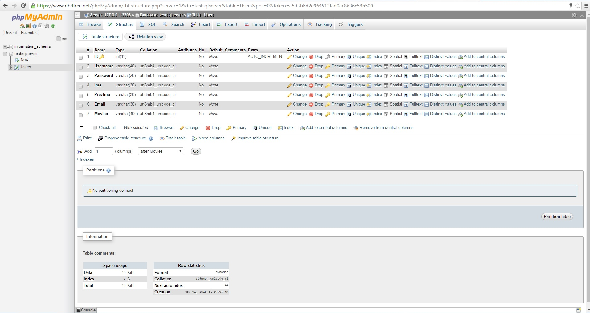

# Документација
## 1. Oпис на апликацијата ##
   Апликацијата која што ја изработивме претставува Видеотека со голем асортиман/избор на филмови за прегледување/preview (кратка содржина - plot од избраниот филм, genre, cast - учесници, runtime - времетраење, година на издавање и можност за гледање на trailer од избраниот филм). Покрај можноста за прегледување на филмови, апликацијата дополнително овозможува за секој најавен корисник изнајмување на посакуваниот филм на одреден временски рок. Со цел да им се овозможи на корисниците поедноставено користење на самата Видеотека, додадовме функционалност за пребарување на филмови по одреден жанр и по внесено име на филмот. Секој регистриран корисник има привилегија и достапност за увид на својата листа на изнајмени филмови и својот личен, персонален профил и личните податоци.



## 2. Корисничко сценарио/Упатство за користење на апликацијата ##
На горната слика е прикажан основниот изглед на апликацијата (Слика 1). За полесна навигација во самата апликација служи горното мени, кое содржи и некои дополнителни опции, како што е About страницата. Во горниот десен агол се сместени две копчиња: Register&SignIn.
При клик на копчето Register, се отвара нова форма во која корисникот на апликацијата треба да ги пополни сите зададени полиња со своите лични податоци ( Слика 2). Откако ќе биде успешно регистриран, се прикажува соодветна порака за известување (Слика 3). Доколку корисникот веќе се има регистрирано, директно преку копчето SignIn може да се најави на системот. Доколку при најавувањето корисникот, внесе погрешен username или password, исто така ќе се прикаже соодветна порака за грешка (Слика 4).



Откако корисникот ќе се најави, неговиот username се прикажува во горниот десен агол и покрај него опција за одјавување.
На левата страна од прозорецот на апликацијата, прикажани се листа со 20 предефинирани филмови. Со клик на копчето Load more, ќе се излистаат уште 20 дополнителни филмови итн. Во долниот statusStrip се доделува информација за бројот на прикажани филмови. Во самиот центар на апликацијата се наоѓа детален приказ за тековно избраниот филм од листата со филмови (опишано погоре во самиот опис на апликацијата) (Слика 5). Секој најавен корисник има дополнителна можност да изнајми филм, кој ќе биде додаден во неговата кошничка со преостанато време на филмот (Слика 6).



## 3. Претставување на проблемот
За потребите на апликацијата искористени е PHP база на податоци хостирана на следната страна (https://www.db4free.net/), која ни служи за зачувување на податоците на корисникот при регистрацијата и понатамошно пребарување низ истата при валидацијата( најавувањето на корисникот во системот). За приказ, детали и напредно филтрирање на филмови според жанрот и името, користиме Tmdb API.
### 3.1 База на податоци
На сликата бр.7 e прикажана структурата на табелата Users, која содржи 7 колони соодветни за секој User.

Класата **SqlConn** служи за манипулација со податоците на корисниците на апликацијата. Секој метод од оваа класа содржи соодветно **XML summary, детално објаснување**.

```c#
    /// <summary>
    /// Static class for manipulation with Users stored in our DataBase
    /// </summary>
    static class SqlConn
    {
        /// <summary>
        /// connectionString saved in App.config, which is used for establishing a connection with Database
        /// </summary>
        private static readonly string connectionString = ConfigurationManager.ConnectionStrings["DBConnection"].ConnectionString;

        /// <summary>
        /// SignUp method inserts a new record for each registered user in table Users
        /// </summary>
        static public bool SignUp(User user)
        {
            using (MySqlConnection connection = new MySqlConnection(connectionString))
            {
                connection.Open();
                try
                {
                    /// <summary>
                    /// SqlCommand object contains SqlConnection object and queryString (INSERT command with parameters)
                    /// </summary>
                    MySqlCommand commandInsert = new MySqlCommand("INSERT INTO Users(Username,Password,Ime,Prezime,Email,Movies) VALUES(@username,@password,@ime,@prezime,@email,@movies)", connection);
                    commandInsert.Parameters.AddWithValue("@username", user.Username);
                    commandInsert.Parameters.AddWithValue("@password", user.Password);
                    commandInsert.Parameters.AddWithValue("@ime", user.Name);
                    commandInsert.Parameters.AddWithValue("@prezime", user.Surname);
                    commandInsert.Parameters.AddWithValue("@email", user.Email);
                    commandInsert.Parameters.AddWithValue("@movies", "");
                    commandInsert.ExecuteNonQuery();
                    commandInsert.Parameters.Clear();
                    return true;
                }
                catch(SystemException ex)
                {
                    MessageBox.Show(ex.Message);
                    return false;
                }
            }
        }
```
```c#
        /// <summary>
        /// SignIn method returns the user which is LoggedIn (Description)
        /// </summary>
        static public User SignIn(string username)
        {
            using (MySqlConnection connection = new MySqlConnection(connectionString))
            {
                try
                {
                    connection.Open();
                    User user = null;
                    /// <summary>
                    /// queryString = Search in table Users for all records whose username is equal with the username given as a parameter
                    /// </summary>
                    MySqlCommand command = new MySqlCommand("SELECT * FROM Users WHERE Username='" + username + "'", connection);
                    MySqlDataReader dataReader = command.ExecuteReader();
                    if (dataReader.Read() == false) user = null;
                    else
                    {
                        user = new User(dataReader[1].ToString(), dataReader[2].ToString(), dataReader[3].ToString(), dataReader[4].ToString(), dataReader[5].ToString(), dataReader[6].ToString());
                    }
                    return user;

                }
                catch (SystemException ex)
                {
                    MessageBox.Show(ex.Message);
                    return null;
                }
            }
        }
```
```c#        
        /// <summary>
        /// UpdateCard method updates Movies field for the User given as a parameter
        /// This method is used for Renting a Movie
        /// </summary>
        static public bool UpdateCart(User user)
        {
            using (MySqlConnection connection = new MySqlConnection(connectionString))
            {
                try
                {
                    connection.Open();
                    MySqlCommand command = null;
                    if (user.Movies.Count > 0)
                    {
                        StringBuilder sb = new StringBuilder();
                        foreach (KeyValuePair<string, string> kvp in user.Movies.AsEnumerable())
                        {
                            sb.Append(string.Format("{0};{1}>", kvp.Key, kvp.Value));
                        }
                        command = new MySqlCommand("UPDATE Users SET Movies='" + sb.ToString().Substring(0, sb.ToString().Length - 1) + "' WHERE Username='" + user.Username + "'", connection);
                    }
                    else
                    {
                        command = new MySqlCommand("UPDATE Users SET Movies='" + "" + "' WHERE Username='" + user.Username + "'", connection);
                    }
                    command.ExecuteNonQuery();
                    return true;
                }
                catch(SystemException ex)
                {
                    MessageBox.Show(ex.Message);
                    return false;
                }
            }
        }
```
```c#
        /// <summary>
        /// This method is used for UsernameValidation (Checks for existing User with same Username) in SignIn Form
        /// </summary>
        public async static Task<bool> userExists(string username)
        {
            using (MySqlConnection connection = new MySqlConnection(connectionString))
            {
                try
                {
                    await connection.OpenAsync();
                    MySqlCommand command = new MySqlCommand("SELECT * FROM Users WHERE Username='" + username + "'", connection);
                    System.Data.Common.DbDataReader dataReader = await command.ExecuteReaderAsync();
                    return dataReader.Read();
                }
                catch(MySqlException ex)
                {
                    MessageBox.Show(ex.Message);
                    return false;
                }
            }            
        }
    }
```
### 3.2 API
За полесна комуникација со функциите што ги нуди API-то се употребува соодветен .NET Wrapper којшто нуди поддршка за асинхроно извршување на задачите. Методите кои овозможуваат превземање на филмови со највисок рејтинг, филмови од одреден жанр или детални информации за одреден филм се сместени во класа - ```public static class LoadMovies```. Исто како и ```SqlConn``` класата, сите променливи и методи содржат XML summary.
Подолу е прикажан еден од методите за превземање на филмови:

```c#
/// <summary>
        /// Get the top rated movies
        /// </summary>
        /// <returns></returns>
        public static async Task<List<CustomMovie>> TopRated()
        {
            using (var client = new ServiceClient(Key))
            {
                try
                {
                    var movies = await client.Movies.GetTopRatedAsync(null, topRatedPage, token);
                    topRatedTotal = movies.TotalCount;
                    List<CustomMovie> returnList = new List<CustomMovie>();
                    foreach (Movie m in movies.Results)
                    {
                        returnList.Add(new CustomMovie(m));
                    }
                    topRatedPage++;
                    topRatedCount += returnList.Count;
                    return returnList;
                }
                catch (ServiceRequestException)
                {
                    MessageBox.Show("Too may requests, please wait for a few moments");
                    return null;
                }
            }
        }
```

Преку овој асинхрон метод се превземаат филмовите со највисок рејтинг. Прво се воспоставува врска со API-то преку ```ServiceClient``` класата, којашто ги содржи поголемиот број API фунцкции потребни за комуникција со TMDb. Потоа се врши повик преку соодветен метод за превземање на филмовите, притоа ```await``` го суспендира извршувањето на останатиот дел од кодот додека не се добие ```Movies``` колекција со филмови. 

Оваа колекција содржи поле кое што го имплементира ```IEnumerable``` интерфејсот, и содржи објекти од ```Movie``` класата, коишто содржат само основни податоци за филмот, како наслов, опис, постер итн. Ако во меѓувреме не се пребарувани филмови според друг критериум (клучен збор, одреден жанр) и повторно се повика овој метод, ќе даде резултати од следната "страница" (интерна логика на API-то за складирање и подредување на филмовите). Ова важи и за остантите методи коишто пребаруваат филмови по клучен збор/зборови или одреден жанр. Ако има исклучок, којшто најчесто настанува заради премногу побарувања за филмови, се известува корисникот.


За да се добие ```Movie``` објект којшто ќе содржи детални информации за соддветниот филм, се користат методите ```public static async Task<Movie> GetMovie(CustomMovie cm)``` и ```public static async Task<Movie> GetMovie(int id)```. На првиот му се предава објект од ```CustomMovie``` класата, којашто содржи ```Movie``` објект и преоптоварен ```toString()``` метод за соодветна репрезентација во list box-от којшто ги содржи филмовите (иста е и причината за постоењето на класата ```CustomGenre```, која содржи објект од ```Genre``` класата). На вториот директно му се предава ID-то на филмот за којшто се бараат информации (се користи кај методот којшто раководи сo претстојните филмови во главната форма)
