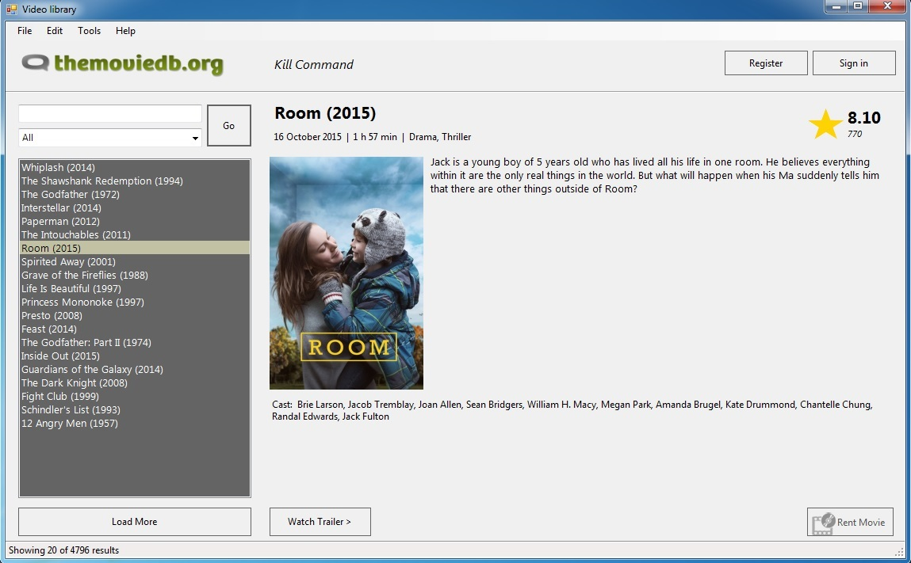

# Документација
## 1. Oпис на апликацијата ##
   Апликацијата која што ја изработивме претставува Видеотека со голем асортиман/избор на филмови за прегледување/preview (кратка содржина - plot од избраниот филм, genre, cast - учесници, runtime - времетраење, година на издавање и можност за гледање на trailer од избраниот филм). Покрај можноста за прегледување на филмови, апликацијата дополнително овозможува за секој најавен корисник изнајмување на посакуваниот филм на одреден временски рок. Со цел да им се овозможи на корисниците поедноставено користење на самата Видеотека, додадовме функционалност за пребарување на филмови по одреден жанр и по внесено име на филмот. Секој регистриран корисник има привилегија и достапност за увид на својата листа на изнајмени филмови и својот личен, персонален профил и личните податоци.
   

## 2. Корисничко сценарио/Упатство за користење на апликацијата
На горната слика е прикажан основниот изглед на апликацијата (Слика 1). Во горниот десен агол се сместени две копчиња: Register & SignIn. При клик на копчето Register, се отвара нова форма во која корисникот на апликацијата треба да ги пополни сите зададени полиња со своите лични податоци ( Слика 2). Откако ќе биде успешно Најавен, се прикажува соодветна порака за известување (Слика 3). Доколку корисникот веќе се има регистрирано, директно преку копчето SignIn може да се најави на системот (Слика 4). Доколку при најавувањето корисникот, внесе погрешен username или password, исто така ќе се прикаже соодветна порака за грешка (Слика 5).

